# CINEMA-JRC - Sistema de Gestión de Cine

## 1. Descripción del Proyecto

CINEMA-JRC es un sistema de gestión de cine que permite a los usuarios reservar entradas para espectáculos, gestionar sus reservas y acceder a información sobre las funciones disponibles. El sistema incluye funcionalidades tanto para usuarios finales como para administradores del cine. MÁS INFO EN: https://deepwiki.com/jrc191/COPIA-PROYECTO-3TRIM

### 1.1 Características Principales
- Reserva de entradas para espectáculos
- Sistema de butacas con diferentes categorías (VIP y estándar)
- Gestión de usuarios y perfiles
- Panel de administración
- Sistema de mensajes al administrador
- Gestión de espectáculos y disponibilidad

### 1.2 Roles del Sistema
- **Usuarios**: Pueden reservar entradas, ver cartelera y gestionar sus reservas
- **Administradores**: Pueden gestionar espectáculos, usuarios, reservas y mensajes

## 2. Tecnologías y Dependencias

### 2.1 Tecnologías Principales
- **Java**: Lenguaje principal de desarrollo
- **JavaFX**: Framework para la interfaz gráfica
- **Oracle**: Base de datos relacional

### 2.2 Frameworks y Bibliotecas
- **JavaFX**: Para la interfaz gráfica
- **JDBC**: Para la conexión con la base de datos

### 2.3 Herramientas de Desarrollo
- **IntelliJ IDEA**: IDE principal
- **Git**: Control de versiones
- **SceneBuilder**: Diseño de FXML

## 3. Arquitectura del Sistema

### 3.1 Patrones de Diseño
- **MVC (Model-View-Controller)**: Separación clara de responsabilidades
- **DAO (Data Access Object)**: Acceso a datos

### 3.2 Capas del Sistema
1. **Presentación (Views)**
    - Interfaces de usuario JavaFX
    - Manejo de eventos
    - Animaciones y transiciones

2. **Control (Controllers)**
    - Lógica de negocio
    - Coordinación entre vistas y modelos
    - Manejo de flujo de datos

3. **Modelo (Models)**
    - Entidades del dominio
    - Reglas de negocio
    - Validaciones

4. **Acceso a Datos (DAO)**
    - Operaciones CRUD
    - Gestión de conexiones
    - Transacciones

### 3.3 Componentes Principales
- **Controllers**: Manejan la lógica de negocio
- **DAO**: Acceso a datos
- **Models**: Entidades del dominio
- **Views**: Interfaces de usuario
- **Utils**: Funciones auxiliares
- **Resources**: Recursos estáticos

## 4. Diagrama de Relaciones entre clases

![[Pasted image 20250518233745.png]]

## 5. Flujo Principal de la Aplicación

### 5.1 Flujo Principal del Usuario

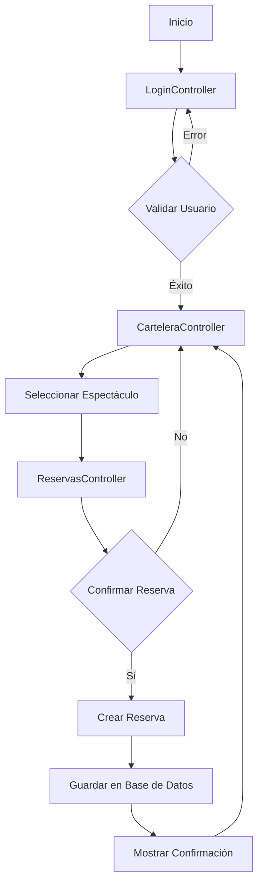

## 6. Flujo de Reserva de Entradas

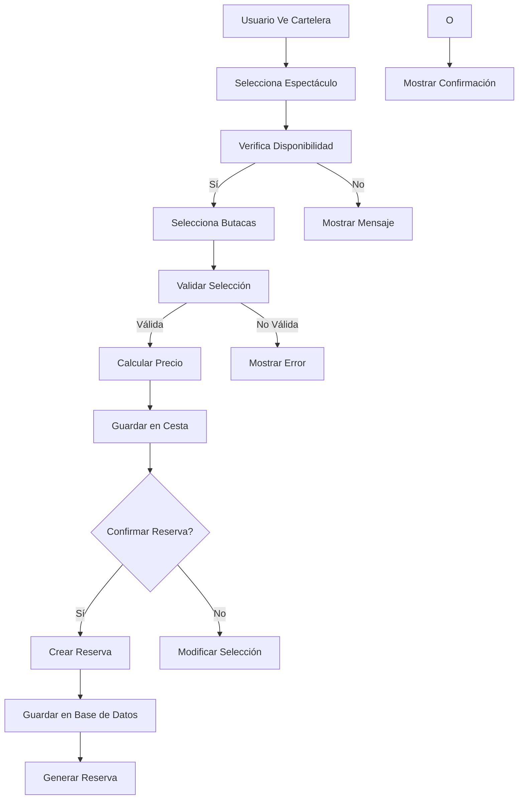

## 7. Flujo de Gestión de Usuarios (Admin)

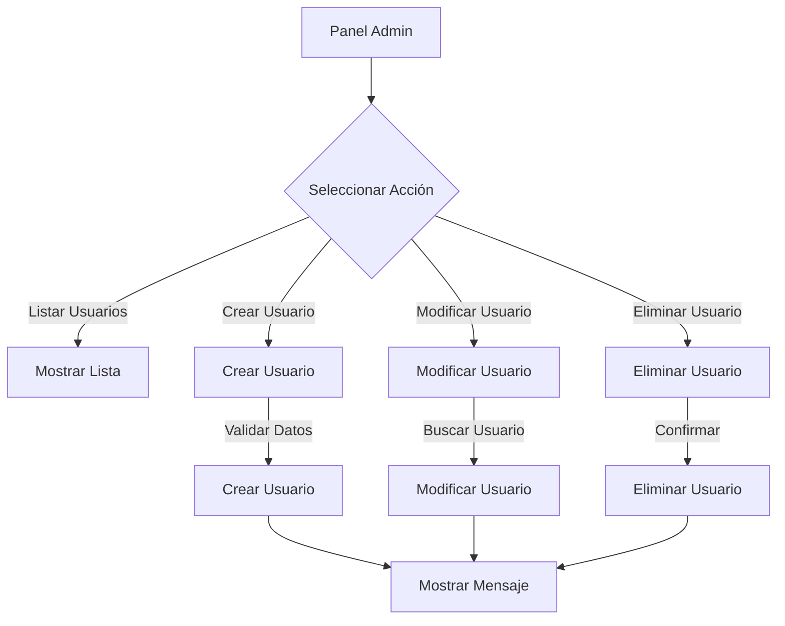

## 8. Flujo de Gestión de Espectáculos (Admin)

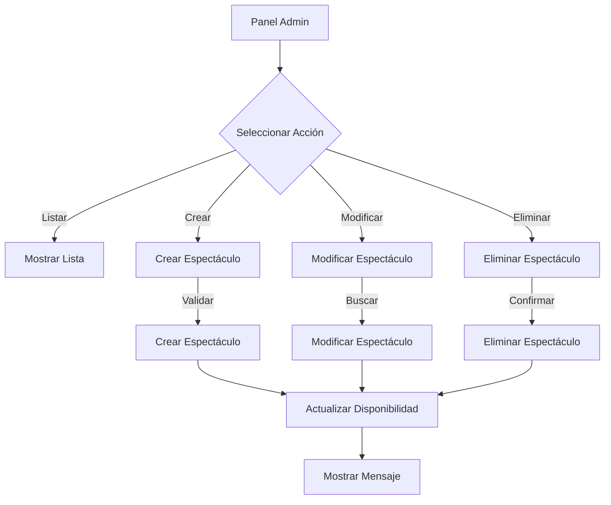

## 9. Flujo de Gestión de Mensajes (Admin)

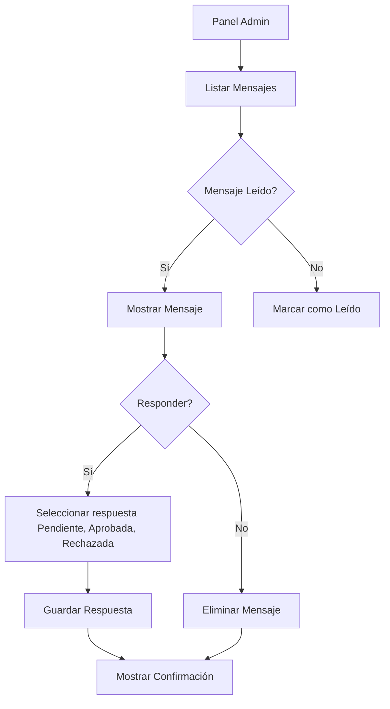

## 10. Flujo de Gestión de Cesta

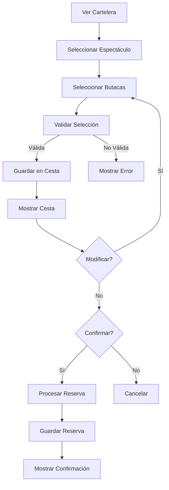

## 11. Flujo de Sesión y Seguridad

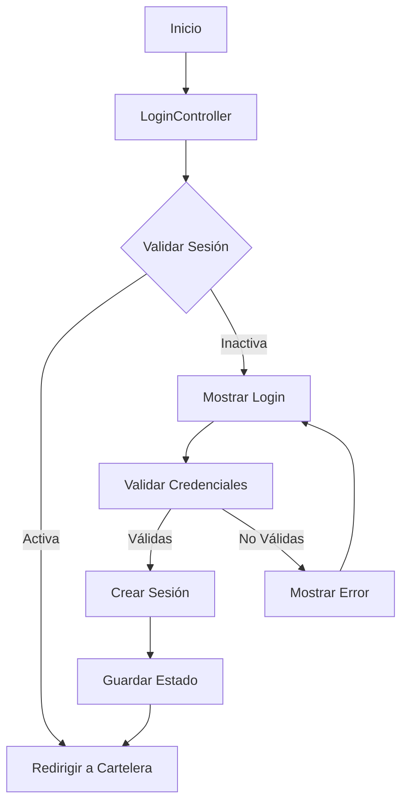

## 12. Flujo de Manejo de Errores

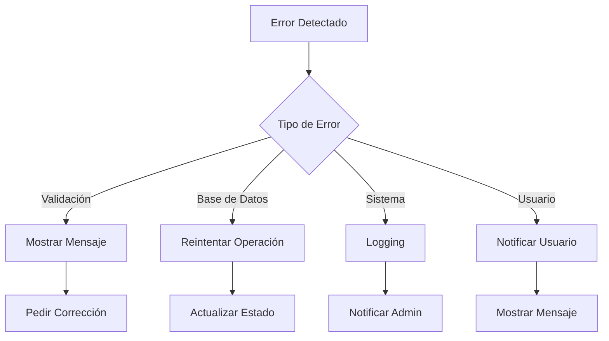

## 13. Flujo de Gestión de Butacas

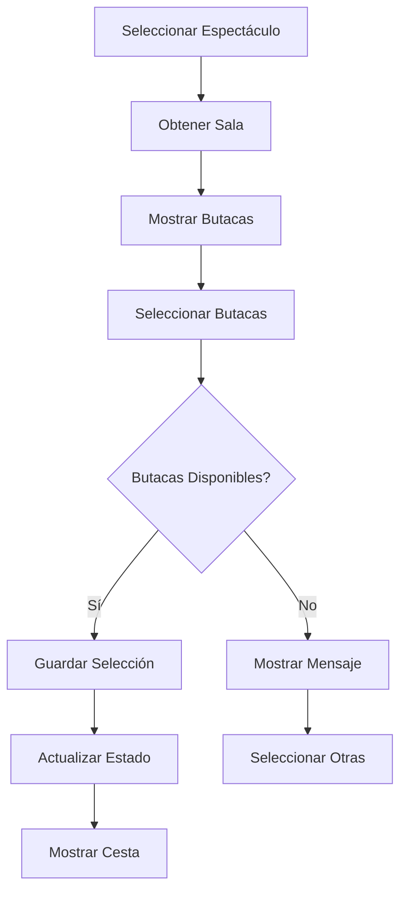

## 14. Flujo de Actualización de Datos

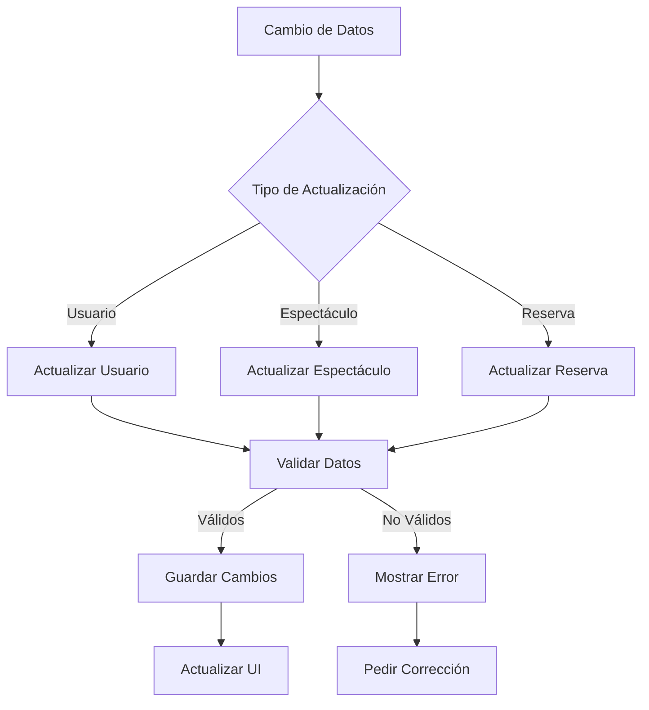

## 15. Flujo de Manejo de Sesiones

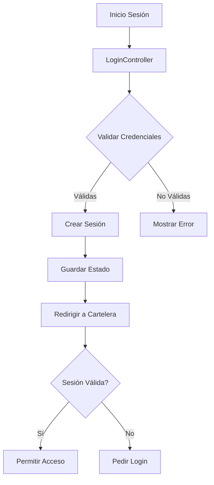

## 16. Clases Principales y Funcionalidades

### 16.1 Controladores

#### CarteleraController
Propiedades:
- Labels para mostrar información
- HBox para contenedor de espectáculos
- TextField para filtro de nombre
- DatePicker para filtro de fecha
- Labels para mensajes y botones

Responsabilidades:
- Gestiona la visualización de espectáculos
- Maneja filtros por nombre y fecha
- Implementa animaciones y transiciones
- Controla el scroll de espectáculos
- Gestiona la interacción con la UI

Funcionalidades:
- Carga de espectáculos
- Filtrado dinámico
- Animaciones de transición
- Manejo de eventos
- Validación de entrada

#### ReservasController
Propiedades:
- Labels para espectáculo y usuario
- GridPane para disposición de butacas
- ChoiceBox para elección
- Lista de butacas (ocupadas, VIP, estándar)
- Rutas de imágenes para butacas

Responsabilidades:
- Gestiona el proceso de reserva
- Valida disponibilidad de butacas
- Calcula precios
- Genera tickets
- Maneja el flujo de confirmación

Funcionalidades:
- Visualización de butacas
- Selección y deselección
- Cálculo de precios
- Generación de ticket
- Validación de disponibilidad

#### LoginController
Propiedades:
- Campos de texto para credenciales
- Labels para mensajes
- Botones de acción

Responsabilidades:
- Maneja la autenticación de usuarios
- Gestiona sesiones
- Valida credenciales
- Redirige según el rol del usuario

Funcionalidades:
- Validación de credenciales
- Gestión de sesiones
- Manejo de estados
- Redirección según rol

### 16.2 Modelos

#### Espectaculo
Propiedades:
- ID único
- Nombre
- Fecha
- Precio base
- Precio VIP

Responsabilidades:
- Representa un espectáculo
- Almacena información de precios
- Gestiona fechas

Funcionalidades:
- Getters y setters
- Validación de precios
- Manejo de fechas
- Cálculo de precios

#### Usuario
Propiedades:
- ID
- Nombre
- Email
- Contraseña
- Rol (usuario/admin)

Responsabilidades:
- Representa un usuario del sistema
- Gestiona credenciales
- Define permisos

Funcionalidades:
- Autenticación
- Gestión de perfil
- Validación de credenciales
- Manejo de roles

#### Reservas
Propiedades:
- ID
- Usuario
- Espectáculo
- Fecha
- Estado

Responsabilidades:
- Representa una reserva
- Gestiona el estado
- Almacena información de usuario

Funcionalidades:
- Cálculo de precio total
- Generación de ticket
- Validación de disponibilidad
- Actualización de estado

### 16.3 DAOs

#### EspectaculoDao
Propiedades:
- Conexión a base de datos
- Consultas SQL

Responsabilidades:
- CRUD de espectáculos
- Búsqueda por criterios
- Gestión de disponibilidad
- Actualización de precios

Funcionalidades:
- Crear espectáculos
- Leer espectáculos
- Actualizar datos
- Eliminar espectáculos
- Filtrado avanzado

#### UsuarioDao
Propiedades:
- Conexión a base de datos
- Consultas de autenticación

Responsabilidades:
- Autenticación
- Gestión de usuarios
- Búsqueda de usuarios
- Actualización de perfiles

Funcionalidades:
- Validación de credenciales
- Gestión de sesiones
- Búsqueda por criterios
- Actualización de datos

#### ReservasDao
Propiedades:
- Conexión a base de datos
- Consultas de disponibilidad

Responsabilidades:
- Gestión de reservas
- Validación de disponibilidad
- Generación de tickets
- Historial de reservas

Funcionalidades:
- Crear reservas
- Validar disponibilidad
- Generar tickets
- Consultar historial
- Actualizar estado

### 16.4 Utilidades

#### DatabaseConnection
Propiedades:
- Pool de conexiones
- Configuración de base de datos

Responsabilidades:
- Conexión a base de datos
- Manejo de transacciones
- Pool de conexiones
- Manejo de errores

Funcionalidades:
- Conexión/Desconexión
- Manejo de transacciones
- Pool de conexiones
- Manejo de errores

#### Transitions
Propiedades:
- Efectos de transición
- Duraciones
- Estilos

Responsabilidades:
- Animaciones UI
- Transiciones
- Efectos visuales
- Manejo de estados

Funcionalidades:
- Animaciones básicas
- Transiciones complejas
- Efectos visuales
- Manejo de estados

### 16.5 Recomendaciones de Uso

#### Para Administradores
- Seguir el flujo de administración
- Usar el panel de administración para gestión
- Mantener respaldos de datos

#### Para Usuarios
- Seguir el flujo de reserva
- Mantener sesiones activas
- Verificar confirmaciones de reserva

## 17. Mejoras Futuras

### 17.1 Optimizaciones Posibles
- Implementar caché para datos frecuentemente accedidos
- Agregar más validaciones en el flujo de reserva
- Mejorar el manejo de errores con más detalles

### 17.2 Nuevas Funcionalidades A implementar a futuro
- Sistema de reseñas
- Sistema de notificaciones
- Historial de búsquedas

